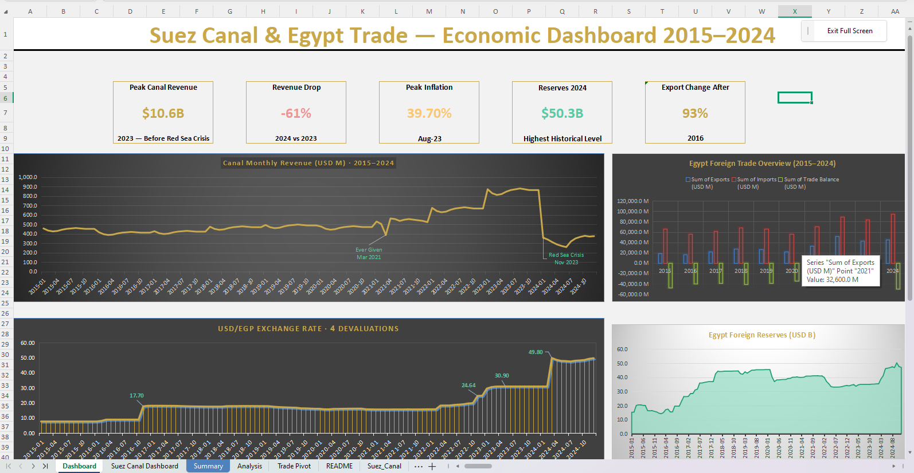

# Suez Canal & Egypt Trade Dashboard (2015–2024)\
## Dashboard Preview

## Overview
This project analyzes the Suez Canal, Egypt's foreign trade, exchange rate movements, inflation, foreign reserves, and oil prices from 2015 to 2024.

## Key Analyses
- Suez Canal Revenue Trends
- Red Sea Crisis Impact (2024)
- COVID-19 Impact (2020)
- Oil Price vs Canal Traffic Correlation
- Exchange Rate Devaluations
- Foreign Trade Balance Analysis
- Foreign Reserves Development

## Key Findings
- Canal revenue declined by 61% during the Red Sea Crisis.
- Oil prices showed a moderate positive correlation with canal traffic.
- Egyptian exports increased significantly after the 2016 flotation.
- Egypt's trade deficit remained persistent throughout the study period.

## Tools Used
- Microsoft Excel
- Pivot Tables
- Correlation Analysis
- Moving Average Analysis
- Dashboard Design
  
## Skills Demonstrated
- Excel Dashboard Design
- Data Cleaning
- Data Validation
- Pivot Tables
- Time-Series Analysis
- Correlation Analysis
- Economic Analysis
- Data Visualization

## Author
Mohamed Fareed
Faculty of Economic Studies and Political Science
Alexandria University
